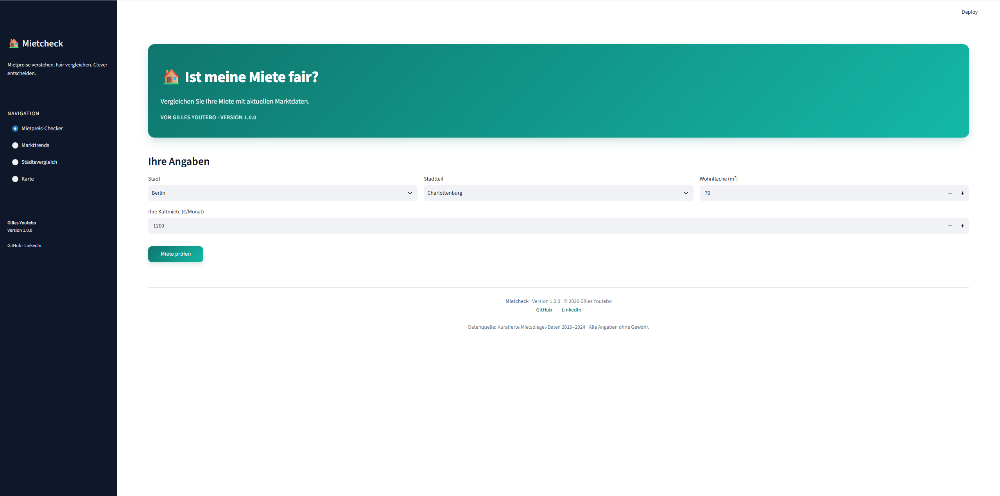

# 🏠 Mietcheck — Mietpreisanalyse für Deutschland

> Ein interaktives Analyse-Tool für Mietpreise in deutschen Großstädten — gebaut mit Streamlit, Pandas und Plotly.

[](https://www.python.org/)
[](https://streamlit.io/)
[](https://plotly.com/)

---

## 🔗 Live Demo

👉 **[mietcheck.streamlit.app](https://mietcheck-gilles177.streamlit.app)**

---

## 📸 Screenshot



---

## 📖 Über das Projekt

**Mietcheck** beantwortet die Frage, die sich jeder Mieter in Deutschland stellt:

> *"Ist meine Miete eigentlich fair?"*

Das Tool vergleicht eine eingegebene Kaltmiete mit aktuellen Marktdaten aus 5 deutschen Großstädten und 25 Stadtteilen — auf Basis kuratierter Mietspiegeldaten von 2019 bis 2024. Es kombiniert klassische Datenanalyse mit interaktiver Visualisierung und einem einfachen Machine-Learning-Modell zur Mietprognose.

---

## ✨ Features

### 🏠 Mietpreis-Checker

- Eingabe von Stadt, Stadtteil, Wohnfläche und Kaltmiete
- Vergleich mit dem lokalen Durchschnitt
- Ampel-System: fair / zu teuer / günstig
- Lineare Regression zur Schätzung der fairen Miete (mit R²-Score)
- Horizontales Balkendiagramm: Mietniveau aller Stadtteile der gewählten Stadt

### 📈 Markttrends

- Interaktiver Linien-Chart: Mietentwicklung 2019–2024
- Mehrere Städte gleichzeitig vergleichbar
- CAGR-Tabelle: jährliche Wachstumsrate pro Stadt

### 🏙️ Städtevergleich

- Direkter Vergleich der durchschnittlichen Miete pro m²
- Pivot-Tabelle mit allen Stadtteilen

### 🗺️ Mietkarte

- Interaktive OpenStreetMap-Karte
- Farbcodierte Bubbles (rot = teuer, grün = günstig)
- Top-10-Liste der teuersten Stadtteile

---

## 🛠 Tech Stack

| Kategorie | Technologie |
|---|---|
| Sprache | Python 3.12 |
| Web-Framework | Streamlit |
| Datenverarbeitung | Pandas, NumPy |
| Visualisierung | Plotly Express |
| Machine Learning | Scikit-learn (LinearRegression) |
| Styling | Custom CSS |

---

## 🚀 Lokale Installation

```bash
git clone https://github.com/Gilles177/mietcheck.git
cd mietcheck
python3 -m venv .venv
source .venv/bin/activate
pip install -r requirements.txt
streamlit run app.py
```

Die App öffnet sich automatisch unter http://localhost:8501

## 📁 Projektstruktur

```text
mietcheck/
├── app.py
├── requirements.txt
├── README.md
├── LICENSE
├── .gitignore
├── .streamlit/
│   └── config.toml
├── docs/
│   └── screenshot.png
├── data/
│   ├── mietspiegel_2024.csv
│   ├── mietspiegel_historical.csv
│   └── staedte_koordinaten.csv
└── src/
    ├── __init__.py
    ├── config.py
    ├── styles.py
    ├── data_loader.py
    └── analysis.py
```

## 📊 Datenquelle

Die verwendeten Mietdaten sind kuratierte Beispieldaten, die auf öffentlich zugänglichen Mietspiegeln deutscher Großstädte basieren.

- **Städte:** Berlin · München · Hamburg · Köln · Frankfurt
- **Zeitraum:** 2019 – 2024
- **Stadtteile:** 25

Für die produktive Nutzung können die Daten über die GENESIS-Online-API des Statistischen Bundesamtes (Destatis) bezogen werden.

## 🗺 Roadmap

- [x] Mietpreis-Checker mit Ampel-System
- [x] Markttrends mit CAGR
- [x] Interaktive Karte
- [x] ML-basierte Mietprognose
- [ ] Anbindung an Destatis GENESIS-API (Live-Daten)
- [ ] Erweiterung auf alle 16 Bundesländer
- [ ] PDF-Export des Mietcheck-Reports

## 👤 Autor

**Gilles Youtebo**

- GitHub: [@Gilles177](https://github.com/Gilles177)
- LinkedIn: [linkedin.com/in/gilles-yamdeu](https://linkedin.com/in/gilles-yamdeu)

## 📄 Lizenz

Dieses Projekt steht unter der MIT-Lizenz, siehe [LICENSE](LICENSE) für Details.

<p align="center"> <sub>Made with ❤️ in Deutschland</sub> </p>
